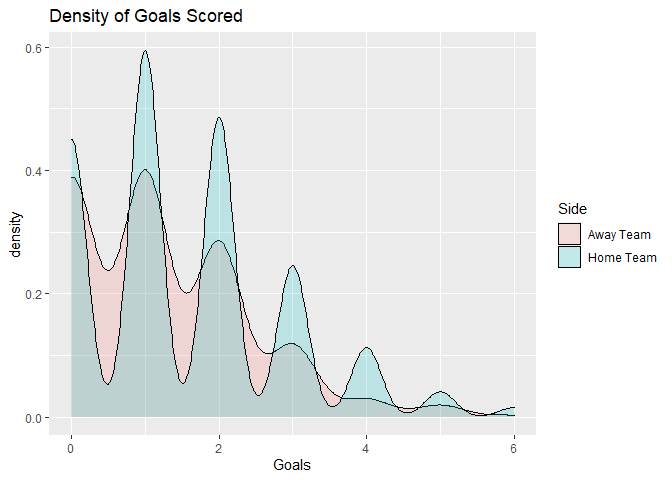
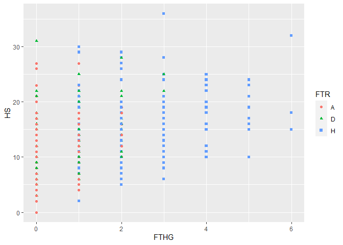
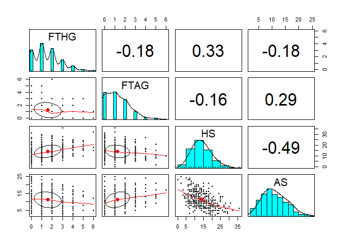

2018-19 Premier League Prediction, DA5030 Final
================
Kalsang Sherpa

#### Required packages

``` r
library(tidyverse)
library(psych)
library(randomForest)
library(class)
library(e1071)
library(gmodels)
library(ROSE)
library(scutr)
```

### **Business Understanding**

Sports betting and gambling is a very data-driven profession and
activity. It requires the use of probabilities and statistics for people
to interpret and make predictions about the outcomes of matches and
player performances. Soccer, otherwise known as football, is one of the
world’s most popular sports and is a sport where millions of people make
bets on every day. Therefore, we decided to build a predictive model
that predicts the outcome of matches in the English Premier League over
the 2018-19 season.

### **Data Understanding**

Below we loaded in the data for the English Premier League 2018-19
season and the dictionary of features, which we will be looking at time
to time. The tibble contains 380 observation with 62 variables. Given
that there are 20 teams that all face each other twice a season and
since you can’t play yourself, 380 observations seems include every
possible match in the season. The data set however does seem to contain
a bit of redundant and unnecessary features that we will probably be
removing.

Looking at the data there is no missing data, and the data seems to be
clean and neat, however there is quite a few features that we will not
be using. Looking at the dictionary a lot of the features in the data
set are betting odds which we won’t use since it would make the reliant
too dependent on those features. Lastly looking at the features we can
also see that a vast majority of our features are numeric.

In most sport scenarios, there is a slight morale advantage to the home
team. Here we checked it out by looking at the total home goals vs away
goals, in which the home team outscored the away team 596 goals to 476.
In these games 181(47.63%) times the home team won, 128(33.68%) the away
team won and 71(18.68%) times both teams drew. In the overlapping
density plot we can see that the peaks for the goals scored by the home
team are higher than the away team and the minimums are lower than the
away team. Also 60% of the total games had the same half time and full
time result, giving us a correlation of 0.6298 between the two.

Looking at the distribution of full time home and away goals the data
seems to be skewed more to the right. In real life more often than not
soccer games are not shoot outs with teams rapidly scoring on both ends
so it makes sense that the distribution would favor the mode being
greater than the mean. However for home shots and away shots, they both
seem to display a normal distribution. There also doesn’t seem to be
much correlation between these features. Lastly we also looked at the
proportion of full time results, in almost half the games, the home side
ended up with the win, whereas an underwhelming 18.7% of games ended in
a draw.

``` r
# load data and data dictionary.
prem.dat <- read_csv("EPL1819.csv")
prem.dict <- read.delim("EPLdictionary.txt", sep = "=")

# Look at the data types. 
glimpse(prem.dat)
```

    ## Rows: 380
    ## Columns: 62
    ## $ Div        <chr> "E0", "E0", "E0", "E0", "E0", "E0", "E0", "E0", "E0", "E0",~
    ## $ Date       <chr> "10/08/2018", "11/08/2018", "11/08/2018", "11/08/2018", "11~
    ## $ HomeTeam   <chr> "Man United", "Bournemouth", "Fulham", "Huddersfield", "New~
    ## $ AwayTeam   <chr> "Leicester", "Cardiff", "Crystal Palace", "Chelsea", "Totte~
    ## $ FTHG       <dbl> 2, 2, 0, 0, 1, 2, 2, 0, 4, 0, 0, 3, 2, 2, 3, 1, 3, 1, 6, 0,~
    ## $ FTAG       <dbl> 1, 0, 2, 3, 2, 0, 2, 2, 0, 0, 0, 2, 1, 0, 1, 2, 2, 3, 1, 2,~
    ## $ FTR        <chr> "H", "H", "A", "A", "A", "H", "D", "A", "H", "D", "D", "H",~
    ## $ HTHG       <dbl> 1, 1, 0, 0, 1, 1, 1, 0, 2, 0, 0, 2, 2, 2, 1, 1, 3, 1, 3, 0,~
    ## $ HTAG       <dbl> 0, 0, 1, 2, 2, 0, 1, 1, 0, 0, 0, 2, 0, 0, 0, 0, 1, 1, 1, 1,~
    ## $ HTR        <chr> "H", "H", "A", "A", "A", "H", "D", "A", "H", "D", "D", "D",~
    ## $ Referee    <chr> "A Marriner", "K Friend", "M Dean", "C Kavanagh", "M Atkins~
    ## $ HS         <dbl> 8, 12, 15, 6, 15, 19, 11, 9, 18, 18, 12, 24, 13, 6, 25, 11,~
    ## $ AS         <dbl> 13, 10, 10, 13, 15, 6, 6, 17, 5, 16, 12, 15, 15, 11, 10, 12~
    ## $ HST        <dbl> 6, 4, 6, 1, 2, 5, 4, 3, 8, 3, 1, 11, 7, 2, 11, 5, 3, 3, 14,~
    ## $ AST        <dbl> 4, 1, 9, 4, 5, 0, 5, 8, 2, 6, 6, 6, 4, 3, 3, 5, 3, 6, 1, 6,~
    ## $ HF         <dbl> 11, 11, 9, 9, 11, 10, 8, 11, 14, 10, 14, 12, 8, 10, 9, 14, ~
    ## $ AF         <dbl> 8, 9, 11, 8, 12, 16, 7, 14, 9, 9, 16, 9, 20, 8, 5, 10, 13, ~
    ## $ HC         <dbl> 2, 7, 5, 2, 3, 8, 3, 2, 5, 8, 5, 5, 2, 1, 5, 6, 3, 5, 10, 6~
    ## $ AC         <dbl> 5, 4, 5, 5, 5, 2, 6, 9, 4, 5, 5, 1, 5, 9, 2, 4, 5, 2, 3, 7,~
    ## $ HY         <dbl> 2, 1, 1, 2, 2, 2, 0, 2, 1, 0, 2, 0, 0, 2, 0, 6, 1, 1, 0, 1,~
    ## $ AY         <dbl> 1, 1, 2, 1, 2, 2, 1, 2, 2, 1, 2, 2, 5, 1, 0, 2, 1, 2, 2, 1,~
    ## $ HR         <dbl> 0, 0, 0, 0, 0, 0, 0, 0, 0, 0, 0, 0, 0, 1, 0, 0, 0, 0, 0, 1,~
    ## $ AR         <dbl> 0, 0, 0, 0, 0, 0, 1, 0, 0, 0, 1, 0, 0, 0, 0, 0, 0, 0, 0, 0,~
    ## $ B365H      <dbl> 1.57, 1.90, 2.50, 6.50, 3.90, 2.37, 2.37, 4.00, 1.25, 1.85,~
    ## $ B365D      <dbl> 3.9, 3.6, 3.4, 4.0, 3.5, 3.2, 3.3, 3.8, 6.5, 3.5, 3.1, 4.0,~
    ## $ B365A      <dbl> 7.50, 4.50, 3.00, 1.61, 2.04, 3.40, 3.30, 1.95, 14.00, 5.00~
    ## $ BWH        <dbl> 1.53, 1.90, 2.45, 6.25, 3.80, 2.35, 2.35, 3.70, 1.20, 1.80,~
    ## $ BWD        <dbl> 4.00, 3.40, 3.30, 3.90, 3.50, 3.10, 3.20, 3.75, 6.75, 3.50,~
    ## $ BWA        <dbl> 7.50, 4.40, 2.95, 1.57, 2.00, 3.30, 3.20, 1.95, 14.00, 4.75~
    ## $ IWH        <dbl> 1.55, 1.90, 2.40, 6.20, 3.70, 2.20, 2.25, 3.60, 1.25, 1.80,~
    ## $ IWD        <dbl> 3.80, 3.50, 3.30, 4.00, 3.35, 3.30, 3.35, 3.60, 6.10, 3.60,~
    ## $ IWA        <dbl> 7.00, 4.10, 2.95, 1.55, 2.05, 3.40, 3.20, 2.00, 11.00, 4.50~
    ## $ PSH        <dbl> 1.58, 1.89, 2.50, 6.41, 3.83, 2.43, 2.36, 4.00, 1.27, 1.86,~
    ## $ PSD        <dbl> 3.93, 3.63, 3.46, 4.02, 3.57, 3.22, 3.40, 3.97, 6.35, 3.51,~
    ## $ PSA        <dbl> 7.50, 4.58, 3.00, 1.62, 2.08, 3.33, 3.28, 1.93, 13.25, 4.99~
    ## $ WHH        <dbl> 1.57, 1.91, 2.45, 5.80, 3.80, 2.38, 2.30, 3.80, 1.25, 1.83,~
    ## $ WHD        <dbl> 3.80, 3.50, 3.30, 3.90, 3.20, 3.00, 3.20, 3.80, 5.50, 3.25,~
    ## $ WHA        <dbl> 6.00, 4.00, 2.80, 1.57, 2.05, 3.30, 3.20, 1.91, 12.00, 4.80~
    ## $ VCH        <dbl> 1.57, 1.87, 2.50, 6.50, 3.90, 2.40, 2.38, 3.90, 1.25, 1.85,~
    ## $ VCD        <dbl> 4.00, 3.60, 3.40, 4.00, 3.40, 3.20, 3.30, 4.00, 6.50, 3.40,~
    ## $ VCA        <dbl> 7.00, 4.75, 3.00, 1.62, 2.10, 3.40, 3.30, 1.91, 13.00, 5.20~
    ## $ Bb1X2      <dbl> 39, 39, 39, 38, 39, 39, 38, 39, 38, 39, 41, 41, 40, 41, 41,~
    ## $ BbMxH      <dbl> 1.60, 1.93, 2.60, 6.85, 4.01, 2.48, 2.41, 4.15, 1.29, 1.90,~
    ## $ BbAvH      <dbl> 1.56, 1.88, 2.47, 6.09, 3.83, 2.36, 2.33, 3.83, 1.25, 1.84,~
    ## $ BbMxD      <dbl> 4.20, 3.71, 3.49, 4.07, 3.57, 3.30, 3.40, 4.00, 6.79, 3.61,~
    ## $ BbAvD      <dbl> 3.92, 3.53, 3.35, 3.90, 3.40, 3.14, 3.27, 3.80, 6.22, 3.43,~
    ## $ BbMxA      <dbl> 8.05, 4.75, 3.05, 1.66, 2.12, 3.42, 3.40, 2.00, 15.00, 5.20~
    ## $ BbAvA      <dbl> 7.06, 4.37, 2.92, 1.61, 2.05, 3.31, 3.23, 1.92, 12.30, 4.80~
    ## $ BbOU       <dbl> 38, 38, 38, 37, 38, 37, 36, 36, 33, 37, 38, 39, 38, 39, 38,~
    ## $ `BbMx>2.5` <dbl> 2.12, 2.05, 2.00, 2.05, 2.10, 2.46, 2.20, 1.60, 1.49, 2.45,~
    ## $ `BbAv>2.5` <dbl> 2.03, 1.98, 1.95, 1.98, 2.01, 2.35, 2.09, 1.55, 1.44, 2.34,~
    ## $ `BbMx<2.5` <dbl> 1.85, 1.92, 1.96, 1.90, 1.88, 1.67, 1.83, 2.55, 2.88, 1.67,~
    ## $ `BbAv<2.5` <dbl> 1.79, 1.83, 1.87, 1.84, 1.81, 1.59, 1.75, 2.42, 2.72, 1.60,~
    ## $ BbAH       <dbl> 17, 20, 22, 23, 20, 22, 22, 20, 21, 20, 21, 21, 20, 21, 21,~
    ## $ BbAHh      <dbl> -0.75, -0.75, -0.25, 1.00, 0.25, -0.25, -0.25, 0.75, -1.75,~
    ## $ BbMxAHH    <dbl> 1.75, 2.20, 2.18, 1.84, 2.20, 2.07, 2.04, 1.78, 1.95, 2.19,~
    ## $ BbAvAHH    <dbl> 1.70, 2.13, 2.11, 1.80, 2.12, 2.01, 1.98, 1.74, 1.90, 2.11,~
    ## $ BbMxAHA    <dbl> 2.29, 1.80, 1.81, 2.13, 1.80, 1.90, 1.92, 2.21, 2.06, 1.82,~
    ## $ BbAvAHA    <dbl> 2.21, 1.75, 1.77, 2.06, 1.76, 1.86, 1.88, 2.15, 1.97, 1.76,~
    ## $ PSCH       <dbl> 1.55, 1.88, 2.62, 7.24, 4.74, 2.58, 2.44, 4.43, 1.25, 2.03,~
    ## $ PSCD       <dbl> 4.07, 3.61, 3.38, 3.95, 3.53, 3.08, 3.23, 4.13, 6.95, 3.19,~
    ## $ PSCA       <dbl> 7.69, 4.70, 2.90, 1.58, 1.89, 3.22, 3.32, 1.81, 12.00, 4.65~

``` r
# Check for missing data.
sum(is.na(prem.dat))
```

    ## [1] 0

``` r
# Home vs Away
sum(prem.dat$FTHG)
```

    ## [1] 596

``` r
sum(prem.dat$FTAG)
```

    ## [1] 476

``` r
# Get number of games where home team drew, won and lost against the away team.
nrow(prem.dat[prem.dat$FTHG == prem.dat$FTAG,])
```

    ## [1] 71

``` r
nrow(prem.dat[prem.dat$FTHG > prem.dat$FTAG,])
```

    ## [1] 181

``` r
nrow(prem.dat[prem.dat$FTHG < prem.dat$FTAG,])
```

    ## [1] 128

``` r
# Get the percent of times where half time result was the same as the full time result.
nrow(prem.dat[prem.dat$FTR == prem.dat$HTR,]) / 380
```

    ## [1] 0.6

``` r
cor(as.numeric(as.factor(prem.dat$FTR)), as.numeric(as.factor(prem.dat$HTR)))
```

    ## [1] 0.6297681

``` r
# distribution of home goals vs away goals 
prem.dat %>%
  pivot_longer(cols = c('FTHG', 'FTAG'), names_to = "HA", values_to = "Goals") %>%
  ggplot(aes(x = Goals, fill = HA)) + 
    geom_density(alpha = 0.2) +
    labs(xlab = "Goals Scored", ylab = "Density", title = "Density of Goals Scored") +
    scale_fill_discrete(name = "Side", labels = c("Away Team", "Home Team"))
```

<!-- -->

``` r
# Use home goals and home team shots too look at shots to goals and wins to losses graph.
ggplot(data = prem.dat, aes(x = FTHG, y = HS, shape = FTR)) +
  geom_point(aes(color = FTR))
```

<!-- -->

``` r
# View correlation of full time goals, shots taken by both teams.
pairs.panels(subset(prem.dat, select = c(FTHG, FTAG, HS, AS)))
```

<!-- -->

``` r
prop.table(table(prem.dat$FTR)) * 100
```

    ## 
    ##        A        D        H 
    ## 33.68421 18.68421 47.63158

``` r
cor(as.numeric(as.factor(prem.dat$FTR)), as.numeric(as.factor(prem.dat$HTR)))
```

    ## [1] 0.6297681

### **Data Preparation**

With a better understanding of the data set, now we will begin preparing
the data. Every feature from column 24 to 62, we will remove since they
are probabilities generated from other sports betting sites and it would
heavily affect our model. This now makes our last feature of the data
set AR(Away Team Red Cards). Next we removed the division, data and
referee. All three of these features are encoded as characters, division
is the same value for all observations since all teams are in the same
league, date did not seem to be a compelling feature and referee seems
obsolete since we have the amount of yellow and red cards given as a
feature. Home Team and Away Team names were also removed since we plan
on only using match stats to make predictions and will not be using
previous assumptions about the team.

We also have to change the values of HTR to numeric values. We have 3
possible values for both which is H, A, D. We will turn them into 0 for
A, 1 for D and 2 for H. Full time away goals and Full time home goals
will also be removed. Although they are both numeric values, they
explain the data too well since FTHG and FTAG would tell our model the
winner of the match without the need for any other feature.

As for normalization and outlier removal, we did not do either of them
since the range of values for all numeric features were all reasonably
close and the values were all discrete. I kept the outliers because I
felt it was necessary for the data set since in sports sometimes teams
do have one-sided victories, especially when facing a weaker opponent.

``` r
# Remove features
prem.dat <- prem.dat[,1:23] %>%
  select(-Div, -Date, -Referee, -HomeTeam, -AwayTeam)

# Change full time and half time results to numeric.
prem.dat[prem.dat$HTR == "A",]$HTR <- "0"
prem.dat[prem.dat$HTR == "D",]$HTR <- "1"
prem.dat[prem.dat$HTR == "H",]$HTR <- "2"

prem.dat$HTR <- as.numeric(prem.dat$HTR)

# Remove FTHG and FTAG
prem.dat <- prem.dat %>%
  select(-FTHG, -FTAG)

# Shuffle and split the data.
set.seed(2022)
shuffle <- runif(nrow(prem.dat))
prem.dat <- prem.dat[order(shuffle),]

prem.train <- prem.dat[1:285,]
prem.test <- prem.dat[286:380,]

# Create labels.
label.train <- as.factor(prem.dat$FTR[1:285])
label.test <- as.factor(prem.dat$FTR[286:380])
```

### **Modeling**

Below we created our three models : A Random Forest, k-Nearest Neighbors
algorithm and Support Vecotr Machine. I chose these models because I
thought they would be best for classification.

``` r
# Random Forest Model
rf.model <- randomForest(as.factor(FTR) ~ ., data = prem.train)

# k-NN algorithm.
knn.pred <- knn(train = prem.train[,-1], test = prem.test[,-1], cl = label.train, k = 20 )

# Support Vector Machine.
svm.model <- svm(as.factor(FTR) ~., data = prem.train, kernel = "linear", type = "C-classification")
```

### **Evaluation**

First, we looked at the random forest model which we set to use 500
trees, the default. It had an out of bag estimate of error rate of
34.04% meaning nearly 66 % of our observations were correctly predicted.
This means our model does not seem like the most accurate model and as
we can see most of the errors came in predicting the draws, having a
class error rate of 86.8%. When using it to predict the testing data, we
see that our model predicted 65.26% of the matches correctly. A
reoccurring theme seems to be the models inability to accurately predict
draws. Our model predicted 66% of the away team wins correctly and 85%
of the home wins correctly, however for draws it was only 16.7% correct.

Next, we looked at the predictions we drew with our knn algorithm which
by default used a euclidean distance formula. We see that overall our
accuracy was 63%. Similar to the random forest model, the accuracy for
determining if a match was a draw was much lower. With the knn algorithm
we were only able to correctly predict one match as a draw out of the 18
total draws that occurred.

Lastly, we used a support vector machine to classify the matches and we
had similar results here too. In total there were 163 support vectors
used and the model accuracy came out to be 66.32%. Here as well the
accuracy for predicting draws was extremely low with a 11.11% accuracy.

In order to try and fix the accuracy, one option we looked at was
balancing the data. Since we had a multi-class response variable we used
SCUT from the scutr package to balance the training data. After doing so
all three classes had an equal proportion of 33.33% each. However when
creating the three models again on the new training data set, we didn’t
see an increase in accuracy instead however, we saw a decrease in the
overall accuracy of the new model in comparison to the previous one.

We also built an ensemble that took a vote of all 3 models for the
classification of the matches which had an accuracy of 65.26%.

``` r
# Random Forest Model evaluation
rf.model
```

    ## 
    ## Call:
    ##  randomForest(formula = as.factor(FTR) ~ ., data = prem.train) 
    ##                Type of random forest: classification
    ##                      Number of trees: 500
    ## No. of variables tried at each split: 3
    ## 
    ##         OOB estimate of  error rate: 34.04%
    ## Confusion matrix:
    ##    A D   H class.error
    ## A 67 8  17   0.2717391
    ## D 18 7  28   0.8679245
    ## H 20 6 114   0.1857143

``` r
rf.pred <- predict(rf.model, newdata = prem.test, type= "class")
CrossTable(x = label.test, y = rf.pred, prop.chisq = FALSE)
```

    ## 
    ##  
    ##    Cell Contents
    ## |-------------------------|
    ## |                       N |
    ## |           N / Row Total |
    ## |           N / Col Total |
    ## |         N / Table Total |
    ## |-------------------------|
    ## 
    ##  
    ## Total Observations in Table:  95 
    ## 
    ##  
    ##              | rf.pred 
    ##   label.test |         A |         D |         H | Row Total | 
    ## -------------|-----------|-----------|-----------|-----------|
    ##            A |        24 |         3 |         9 |        36 | 
    ##              |     0.667 |     0.083 |     0.250 |     0.379 | 
    ##              |     0.727 |     0.300 |     0.173 |           | 
    ##              |     0.253 |     0.032 |     0.095 |           | 
    ## -------------|-----------|-----------|-----------|-----------|
    ##            D |         7 |         3 |         8 |        18 | 
    ##              |     0.389 |     0.167 |     0.444 |     0.189 | 
    ##              |     0.212 |     0.300 |     0.154 |           | 
    ##              |     0.074 |     0.032 |     0.084 |           | 
    ## -------------|-----------|-----------|-----------|-----------|
    ##            H |         2 |         4 |        35 |        41 | 
    ##              |     0.049 |     0.098 |     0.854 |     0.432 | 
    ##              |     0.061 |     0.400 |     0.673 |           | 
    ##              |     0.021 |     0.042 |     0.368 |           | 
    ## -------------|-----------|-----------|-----------|-----------|
    ## Column Total |        33 |        10 |        52 |        95 | 
    ##              |     0.347 |     0.105 |     0.547 |           | 
    ## -------------|-----------|-----------|-----------|-----------|
    ## 
    ## 

``` r
# KNN evaluation.
CrossTable(x = label.test, y = knn.pred, prop.chisq = FALSE)
```

    ## 
    ##  
    ##    Cell Contents
    ## |-------------------------|
    ## |                       N |
    ## |           N / Row Total |
    ## |           N / Col Total |
    ## |         N / Table Total |
    ## |-------------------------|
    ## 
    ##  
    ## Total Observations in Table:  95 
    ## 
    ##  
    ##              | knn.pred 
    ##   label.test |         A |         D |         H | Row Total | 
    ## -------------|-----------|-----------|-----------|-----------|
    ##            A |        21 |         1 |        14 |        36 | 
    ##              |     0.583 |     0.028 |     0.389 |     0.379 | 
    ##              |     0.750 |     0.500 |     0.215 |           | 
    ##              |     0.221 |     0.011 |     0.147 |           | 
    ## -------------|-----------|-----------|-----------|-----------|
    ##            D |         4 |         1 |        13 |        18 | 
    ##              |     0.222 |     0.056 |     0.722 |     0.189 | 
    ##              |     0.143 |     0.500 |     0.200 |           | 
    ##              |     0.042 |     0.011 |     0.137 |           | 
    ## -------------|-----------|-----------|-----------|-----------|
    ##            H |         3 |         0 |        38 |        41 | 
    ##              |     0.073 |     0.000 |     0.927 |     0.432 | 
    ##              |     0.107 |     0.000 |     0.585 |           | 
    ##              |     0.032 |     0.000 |     0.400 |           | 
    ## -------------|-----------|-----------|-----------|-----------|
    ## Column Total |        28 |         2 |        65 |        95 | 
    ##              |     0.295 |     0.021 |     0.684 |           | 
    ## -------------|-----------|-----------|-----------|-----------|
    ## 
    ## 

``` r
# SVM evaluation.
svm.model
```

    ## 
    ## Call:
    ## svm(formula = as.factor(FTR) ~ ., data = prem.train, kernel = "linear", 
    ##     type = "C-classification")
    ## 
    ## 
    ## Parameters:
    ##    SVM-Type:  C-classification 
    ##  SVM-Kernel:  linear 
    ##        cost:  1 
    ## 
    ## Number of Support Vectors:  163

``` r
svm.pred <- predict(svm.model, newdata = prem.test)
CrossTable(x = label.test, y = svm.pred, prop.chisq = FALSE)
```

    ## 
    ##  
    ##    Cell Contents
    ## |-------------------------|
    ## |                       N |
    ## |           N / Row Total |
    ## |           N / Col Total |
    ## |         N / Table Total |
    ## |-------------------------|
    ## 
    ##  
    ## Total Observations in Table:  95 
    ## 
    ##  
    ##              | svm.pred 
    ##   label.test |         A |         D |         H | Row Total | 
    ## -------------|-----------|-----------|-----------|-----------|
    ##            A |        25 |         6 |         5 |        36 | 
    ##              |     0.694 |     0.167 |     0.139 |     0.379 | 
    ##              |     0.833 |     0.545 |     0.093 |           | 
    ##              |     0.263 |     0.063 |     0.053 |           | 
    ## -------------|-----------|-----------|-----------|-----------|
    ##            D |         3 |         2 |        13 |        18 | 
    ##              |     0.167 |     0.111 |     0.722 |     0.189 | 
    ##              |     0.100 |     0.182 |     0.241 |           | 
    ##              |     0.032 |     0.021 |     0.137 |           | 
    ## -------------|-----------|-----------|-----------|-----------|
    ##            H |         2 |         3 |        36 |        41 | 
    ##              |     0.049 |     0.073 |     0.878 |     0.432 | 
    ##              |     0.067 |     0.273 |     0.667 |           | 
    ##              |     0.021 |     0.032 |     0.379 |           | 
    ## -------------|-----------|-----------|-----------|-----------|
    ## Column Total |        30 |        11 |        54 |        95 | 
    ##              |     0.316 |     0.116 |     0.568 |           | 
    ## -------------|-----------|-----------|-----------|-----------|
    ## 
    ## 

``` r
prop.table(table(prem.train$FTR))
```

    ## 
    ##         A         D         H 
    ## 0.3228070 0.1859649 0.4912281

``` r
# Create class balance.
balanced.train <- SCUT(prem.train, "FTR")
prop.table(table(balanced.train$FTR))
```

    ## 
    ##         A         D         H 
    ## 0.3333333 0.3333333 0.3333333

``` r
# Random Forest Model
rf.model2 <- randomForest(as.factor(FTR) ~ ., data = balanced.train)

# k-NN algorithm.
knn.pred2 <- knn(train = balanced.train[,-1], test = prem.test[,-1], cl = as.factor(balanced.train$FTR), k = 20 )

# Support Vector Machine.
svm.model2 <- svm(as.factor(FTR) ~., data = balanced.train, kernel = "linear", type = "C-classification")

rf.model2
```

    ## 
    ## Call:
    ##  randomForest(formula = as.factor(FTR) ~ ., data = balanced.train) 
    ##                Type of random forest: classification
    ##                      Number of trees: 500
    ## No. of variables tried at each split: 3
    ## 
    ##         OOB estimate of  error rate: 29.82%
    ## Confusion matrix:
    ##    A  D  H class.error
    ## A 67 20  8   0.2947368
    ## D 14 65 16   0.3157895
    ## H 15 12 68   0.2842105

``` r
rf.pred2 <- predict(rf.model2, newdata = prem.test, type= "class")
CrossTable(x = label.test, y = rf.pred2, prop.chisq = FALSE)
```

    ## 
    ##  
    ##    Cell Contents
    ## |-------------------------|
    ## |                       N |
    ## |           N / Row Total |
    ## |           N / Col Total |
    ## |         N / Table Total |
    ## |-------------------------|
    ## 
    ##  
    ## Total Observations in Table:  95 
    ## 
    ##  
    ##              | rf.pred2 
    ##   label.test |         A |         D |         H | Row Total | 
    ## -------------|-----------|-----------|-----------|-----------|
    ##            A |        23 |        12 |         1 |        36 | 
    ##              |     0.639 |     0.333 |     0.028 |     0.379 | 
    ##              |     0.719 |     0.500 |     0.026 |           | 
    ##              |     0.242 |     0.126 |     0.011 |           | 
    ## -------------|-----------|-----------|-----------|-----------|
    ##            D |         6 |         4 |         8 |        18 | 
    ##              |     0.333 |     0.222 |     0.444 |     0.189 | 
    ##              |     0.188 |     0.167 |     0.205 |           | 
    ##              |     0.063 |     0.042 |     0.084 |           | 
    ## -------------|-----------|-----------|-----------|-----------|
    ##            H |         3 |         8 |        30 |        41 | 
    ##              |     0.073 |     0.195 |     0.732 |     0.432 | 
    ##              |     0.094 |     0.333 |     0.769 |           | 
    ##              |     0.032 |     0.084 |     0.316 |           | 
    ## -------------|-----------|-----------|-----------|-----------|
    ## Column Total |        32 |        24 |        39 |        95 | 
    ##              |     0.337 |     0.253 |     0.411 |           | 
    ## -------------|-----------|-----------|-----------|-----------|
    ## 
    ## 

``` r
# KNN evaluation.
CrossTable(x = label.test, y = knn.pred2, prop.chisq = FALSE)
```

    ## 
    ##  
    ##    Cell Contents
    ## |-------------------------|
    ## |                       N |
    ## |           N / Row Total |
    ## |           N / Col Total |
    ## |         N / Table Total |
    ## |-------------------------|
    ## 
    ##  
    ## Total Observations in Table:  95 
    ## 
    ##  
    ##              | knn.pred2 
    ##   label.test |         A |         D |         H | Row Total | 
    ## -------------|-----------|-----------|-----------|-----------|
    ##            A |        15 |        17 |         4 |        36 | 
    ##              |     0.417 |     0.472 |     0.111 |     0.379 | 
    ##              |     0.625 |     0.362 |     0.167 |           | 
    ##              |     0.158 |     0.179 |     0.042 |           | 
    ## -------------|-----------|-----------|-----------|-----------|
    ##            D |         4 |        11 |         3 |        18 | 
    ##              |     0.222 |     0.611 |     0.167 |     0.189 | 
    ##              |     0.167 |     0.234 |     0.125 |           | 
    ##              |     0.042 |     0.116 |     0.032 |           | 
    ## -------------|-----------|-----------|-----------|-----------|
    ##            H |         5 |        19 |        17 |        41 | 
    ##              |     0.122 |     0.463 |     0.415 |     0.432 | 
    ##              |     0.208 |     0.404 |     0.708 |           | 
    ##              |     0.053 |     0.200 |     0.179 |           | 
    ## -------------|-----------|-----------|-----------|-----------|
    ## Column Total |        24 |        47 |        24 |        95 | 
    ##              |     0.253 |     0.495 |     0.253 |           | 
    ## -------------|-----------|-----------|-----------|-----------|
    ## 
    ## 

``` r
# SVM evaluation.
svm.model2
```

    ## 
    ## Call:
    ## svm(formula = as.factor(FTR) ~ ., data = balanced.train, kernel = "linear", 
    ##     type = "C-classification")
    ## 
    ## 
    ## Parameters:
    ##    SVM-Type:  C-classification 
    ##  SVM-Kernel:  linear 
    ##        cost:  1 
    ## 
    ## Number of Support Vectors:  201

``` r
svm.pred2 <- predict(svm.model2, newdata = prem.test)
CrossTable(x = label.test, y = svm.pred2, prop.chisq = FALSE)
```

    ## 
    ##  
    ##    Cell Contents
    ## |-------------------------|
    ## |                       N |
    ## |           N / Row Total |
    ## |           N / Col Total |
    ## |         N / Table Total |
    ## |-------------------------|
    ## 
    ##  
    ## Total Observations in Table:  95 
    ## 
    ##  
    ##              | svm.pred2 
    ##   label.test |         A |         D |         H | Row Total | 
    ## -------------|-----------|-----------|-----------|-----------|
    ##            A |        23 |        11 |         2 |        36 | 
    ##              |     0.639 |     0.306 |     0.056 |     0.379 | 
    ##              |     0.852 |     0.355 |     0.054 |           | 
    ##              |     0.242 |     0.116 |     0.021 |           | 
    ## -------------|-----------|-----------|-----------|-----------|
    ##            D |         3 |         8 |         7 |        18 | 
    ##              |     0.167 |     0.444 |     0.389 |     0.189 | 
    ##              |     0.111 |     0.258 |     0.189 |           | 
    ##              |     0.032 |     0.084 |     0.074 |           | 
    ## -------------|-----------|-----------|-----------|-----------|
    ##            H |         1 |        12 |        28 |        41 | 
    ##              |     0.024 |     0.293 |     0.683 |     0.432 | 
    ##              |     0.037 |     0.387 |     0.757 |           | 
    ##              |     0.011 |     0.126 |     0.295 |           | 
    ## -------------|-----------|-----------|-----------|-----------|
    ## Column Total |        27 |        31 |        37 |        95 | 
    ##              |     0.284 |     0.326 |     0.389 |           | 
    ## -------------|-----------|-----------|-----------|-----------|
    ## 
    ## 

``` r
# Create an ensemble 
ensemble <- tibble(rf.pred, knn.pred, svm.pred)

# Get the mode of each observation
ensemble$vote <- apply(ensemble[], 1, function(x) {names(which.max(table(factor(x,unique(x)))))})
CrossTable(x = label.test, y = ensemble$vote, prop.chisq = FALSE)
```

    ## 
    ##  
    ##    Cell Contents
    ## |-------------------------|
    ## |                       N |
    ## |           N / Row Total |
    ## |           N / Col Total |
    ## |         N / Table Total |
    ## |-------------------------|
    ## 
    ##  
    ## Total Observations in Table:  95 
    ## 
    ##  
    ##              | ensemble$vote 
    ##   label.test |         A |         D |         H | Row Total | 
    ## -------------|-----------|-----------|-----------|-----------|
    ##            A |        24 |         2 |        10 |        36 | 
    ##              |     0.667 |     0.056 |     0.278 |     0.379 | 
    ##              |     0.750 |     0.500 |     0.169 |           | 
    ##              |     0.253 |     0.021 |     0.105 |           | 
    ## -------------|-----------|-----------|-----------|-----------|
    ##            D |         5 |         1 |        12 |        18 | 
    ##              |     0.278 |     0.056 |     0.667 |     0.189 | 
    ##              |     0.156 |     0.250 |     0.203 |           | 
    ##              |     0.053 |     0.011 |     0.126 |           | 
    ## -------------|-----------|-----------|-----------|-----------|
    ##            H |         3 |         1 |        37 |        41 | 
    ##              |     0.073 |     0.024 |     0.902 |     0.432 | 
    ##              |     0.094 |     0.250 |     0.627 |           | 
    ##              |     0.032 |     0.011 |     0.389 |           | 
    ## -------------|-----------|-----------|-----------|-----------|
    ## Column Total |        32 |         4 |        59 |        95 | 
    ##              |     0.337 |     0.042 |     0.621 |           | 
    ## -------------|-----------|-----------|-----------|-----------|
    ## 
    ## 

``` r
# store the accuracy of each model in a tibble.
rf.acc <- "65.26%"
knn.acc <- "63.16%"
svm.acc <- "66.36%"
ensemble.acc <- "65.26%"
rf.acc2 <- "60.00%"
knn.acc2 <- "45.26%"
svm.acc2 <- "62.11%"

accuracy <- tibble(rf.acc, knn.acc, svm.acc, ensemble.acc, rf.acc2, knn.acc2, svm.acc2 )
accuracy 
```

<div data-pagedtable="false">

<script data-pagedtable-source type="application/json">
{"columns":[{"label":["rf.acc"],"name":[1],"type":["chr"],"align":["left"]},{"label":["knn.acc"],"name":[2],"type":["chr"],"align":["left"]},{"label":["svm.acc"],"name":[3],"type":["chr"],"align":["left"]},{"label":["ensemble.acc"],"name":[4],"type":["chr"],"align":["left"]},{"label":["rf.acc2"],"name":[5],"type":["chr"],"align":["left"]},{"label":["knn.acc2"],"name":[6],"type":["chr"],"align":["left"]},{"label":["svm.acc2"],"name":[7],"type":["chr"],"align":["left"]}],"data":[{"1":"65.26%","2":"63.16%","3":"66.36%","4":"65.26%","5":"60.00%","6":"45.26%","7":"62.11%"}],"options":{"columns":{"min":{},"max":[10]},"rows":{"min":[10],"max":[10]},"pages":{}}}
  </script>

</div>

### **Results**

In the end, out of the three models, it seems that the support-vector
machine performed the best, however by only a small margin. Most of the
inaccuracy for all three models came from the inability to properly
predict draws. Out of our 380 observations it seems that only 71 of them
were draws and we guessed that the low proportion might have been the
reason why it was inaccurate in predicting draws. However, when
balancing out the three classes to have proportions of 33% each, the
three models did not improve, rather the overall accuracy in the model
decreased instead. I believe that soccer is a very volatile sport where
even if one team is dominating the other in terms of shots, shots on
target, number of corners, etc. the other team can still end up winning
or drawing the match with a single counter-attacking goal. We also did
not use any assumptions about the teams playing, meaning that our models
did not take into account the ranks/ratings of the teams playing.
Therefore, there were no added weights or advantages to the stronger
teams in our models. However, overall our model ensemble had an accurcay
of 65.26% which seemed to be decent and if you were to compute the
ability of the ensemble to predict just home or away wins, it had an
accuracy of 79.22%.
