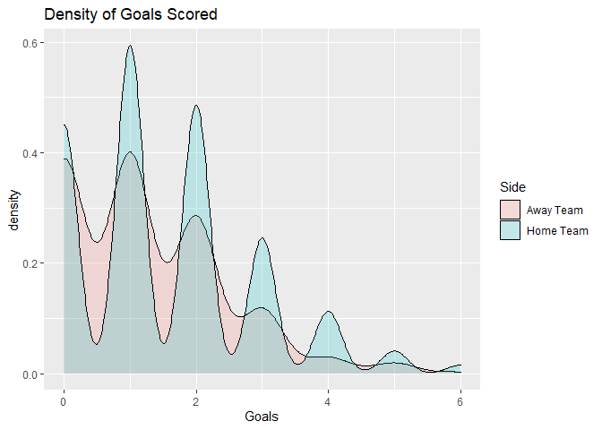
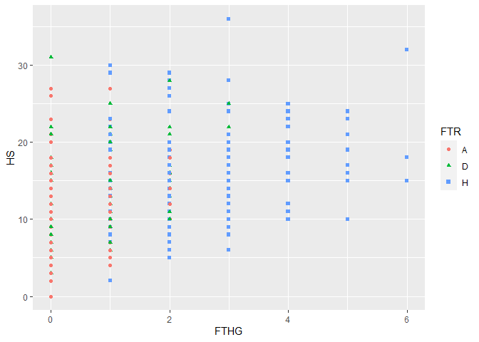
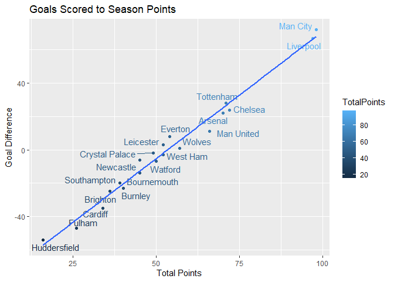

R Notebook
================

#### Required packages

``` r
library(tidyverse)
library(randomForest)
library(gmodels)
library(ggrepel)
```

### **Business Understanding**

Sports betting and gambling is a very data-driven profession and
activity. It requires the use of probabilities and statistics for people
to interpret and make predictions about the outcomes of matches and
player performances. Soccer, otherwise known as football, is one of the
world’s most popular sports and is a sport where millions of people make
bets on every day. Therefore, we decided to build a predictive model
that predicts the outcome of matches in the English Premier League over
the 2018-19 season using the data found here:
<https://datahub.io/sports-data/english-premier-league/r/0.html>.

### **Data Understanding**

Below we loaded in the data for the English Premier League 2018-19
season and the dictionary of features, which we will be looking at time
to time. The tibble contains 380 observation with 62 variables. Given
that there are 20 teams that all face each other twice a season and
since you can’t play yourself, 380 observations seems include every
possible match in the season. The data set however does seem to contain
a bit of redundant and unnecessary features that we will probably be
removing.

Looking at the data there is no missing data, and the data seems to be
clean and neat, however there is quite a few features that we will not
be using. Looking at the dictionary a lot of the features in the data
set are betting odds which we won’t use since it would make the reliant
too dependent on those features. Lastly looking at the features we can
also see that a vast majority of our features are numeric.

In most sport scenarios, there is a slight morale advantage to the home
team. Here we checked it out by looking at the total home goals vs away
goals, in which the home team outscored the away team 596 goals to 476.
In these games 181(47.63%) times the home team won, 128(33.68%) the away
team won and 71(18.68%) times both teams drew. In the overlapping
density plot we can see that the peaks for the goals scored by the home
team are higher than the away team and the minimums are lower than the
away team. Also 60% of the total games had the same half time and full
time result, giving us a correlation of 0.6298 between the two.

We can also see the total amount of goals scored for each club compared
to the amount they allowed, which describes the goal difference for the
season. In the next scatter plot we can see just how well the clubs
performace throughout the year positvely correlates to the goal
difference of the club because at the end of the day the team that
scores the most while allowing the least amount of goals will always be
the better side. The correlation between the total team points and goal
difference came out to a staggering 0.9908.

``` r
# URL for the data. 
URL <- "https://datahub.io/sports-data/english-premier-league/r/0.html"
# load data and data dictionary.
prem.dat <- read_csv("EPL1819.csv")
prem.dict <- read.delim("EPLdictionary.txt", sep = "=")

# Look at the data types. 
glimpse(prem.dat)
```

    ## Rows: 380
    ## Columns: 62
    ## $ Div        <chr> "E0", "E0", "E0", "E0", "E0", "E0", "E0", "E0", "E0", "E0",~
    ## $ Date       <chr> "10/08/2018", "11/08/2018", "11/08/2018", "11/08/2018", "11~
    ## $ HomeTeam   <chr> "Man United", "Bournemouth", "Fulham", "Huddersfield", "New~
    ## $ AwayTeam   <chr> "Leicester", "Cardiff", "Crystal Palace", "Chelsea", "Totte~
    ## $ FTHG       <dbl> 2, 2, 0, 0, 1, 2, 2, 0, 4, 0, 0, 3, 2, 2, 3, 1, 3, 1, 6, 0,~
    ## $ FTAG       <dbl> 1, 0, 2, 3, 2, 0, 2, 2, 0, 0, 0, 2, 1, 0, 1, 2, 2, 3, 1, 2,~
    ## $ FTR        <chr> "H", "H", "A", "A", "A", "H", "D", "A", "H", "D", "D", "H",~
    ## $ HTHG       <dbl> 1, 1, 0, 0, 1, 1, 1, 0, 2, 0, 0, 2, 2, 2, 1, 1, 3, 1, 3, 0,~
    ## $ HTAG       <dbl> 0, 0, 1, 2, 2, 0, 1, 1, 0, 0, 0, 2, 0, 0, 0, 0, 1, 1, 1, 1,~
    ## $ HTR        <chr> "H", "H", "A", "A", "A", "H", "D", "A", "H", "D", "D", "D",~
    ## $ Referee    <chr> "A Marriner", "K Friend", "M Dean", "C Kavanagh", "M Atkins~
    ## $ HS         <dbl> 8, 12, 15, 6, 15, 19, 11, 9, 18, 18, 12, 24, 13, 6, 25, 11,~
    ## $ AS         <dbl> 13, 10, 10, 13, 15, 6, 6, 17, 5, 16, 12, 15, 15, 11, 10, 12~
    ## $ HST        <dbl> 6, 4, 6, 1, 2, 5, 4, 3, 8, 3, 1, 11, 7, 2, 11, 5, 3, 3, 14,~
    ## $ AST        <dbl> 4, 1, 9, 4, 5, 0, 5, 8, 2, 6, 6, 6, 4, 3, 3, 5, 3, 6, 1, 6,~
    ## $ HF         <dbl> 11, 11, 9, 9, 11, 10, 8, 11, 14, 10, 14, 12, 8, 10, 9, 14, ~
    ## $ AF         <dbl> 8, 9, 11, 8, 12, 16, 7, 14, 9, 9, 16, 9, 20, 8, 5, 10, 13, ~
    ## $ HC         <dbl> 2, 7, 5, 2, 3, 8, 3, 2, 5, 8, 5, 5, 2, 1, 5, 6, 3, 5, 10, 6~
    ## $ AC         <dbl> 5, 4, 5, 5, 5, 2, 6, 9, 4, 5, 5, 1, 5, 9, 2, 4, 5, 2, 3, 7,~
    ## $ HY         <dbl> 2, 1, 1, 2, 2, 2, 0, 2, 1, 0, 2, 0, 0, 2, 0, 6, 1, 1, 0, 1,~
    ## $ AY         <dbl> 1, 1, 2, 1, 2, 2, 1, 2, 2, 1, 2, 2, 5, 1, 0, 2, 1, 2, 2, 1,~
    ## $ HR         <dbl> 0, 0, 0, 0, 0, 0, 0, 0, 0, 0, 0, 0, 0, 1, 0, 0, 0, 0, 0, 1,~
    ## $ AR         <dbl> 0, 0, 0, 0, 0, 0, 1, 0, 0, 0, 1, 0, 0, 0, 0, 0, 0, 0, 0, 0,~
    ## $ B365H      <dbl> 1.57, 1.90, 2.50, 6.50, 3.90, 2.37, 2.37, 4.00, 1.25, 1.85,~
    ## $ B365D      <dbl> 3.9, 3.6, 3.4, 4.0, 3.5, 3.2, 3.3, 3.8, 6.5, 3.5, 3.1, 4.0,~
    ## $ B365A      <dbl> 7.50, 4.50, 3.00, 1.61, 2.04, 3.40, 3.30, 1.95, 14.00, 5.00~
    ## $ BWH        <dbl> 1.53, 1.90, 2.45, 6.25, 3.80, 2.35, 2.35, 3.70, 1.20, 1.80,~
    ## $ BWD        <dbl> 4.00, 3.40, 3.30, 3.90, 3.50, 3.10, 3.20, 3.75, 6.75, 3.50,~
    ## $ BWA        <dbl> 7.50, 4.40, 2.95, 1.57, 2.00, 3.30, 3.20, 1.95, 14.00, 4.75~
    ## $ IWH        <dbl> 1.55, 1.90, 2.40, 6.20, 3.70, 2.20, 2.25, 3.60, 1.25, 1.80,~
    ## $ IWD        <dbl> 3.80, 3.50, 3.30, 4.00, 3.35, 3.30, 3.35, 3.60, 6.10, 3.60,~
    ## $ IWA        <dbl> 7.00, 4.10, 2.95, 1.55, 2.05, 3.40, 3.20, 2.00, 11.00, 4.50~
    ## $ PSH        <dbl> 1.58, 1.89, 2.50, 6.41, 3.83, 2.43, 2.36, 4.00, 1.27, 1.86,~
    ## $ PSD        <dbl> 3.93, 3.63, 3.46, 4.02, 3.57, 3.22, 3.40, 3.97, 6.35, 3.51,~
    ## $ PSA        <dbl> 7.50, 4.58, 3.00, 1.62, 2.08, 3.33, 3.28, 1.93, 13.25, 4.99~
    ## $ WHH        <dbl> 1.57, 1.91, 2.45, 5.80, 3.80, 2.38, 2.30, 3.80, 1.25, 1.83,~
    ## $ WHD        <dbl> 3.80, 3.50, 3.30, 3.90, 3.20, 3.00, 3.20, 3.80, 5.50, 3.25,~
    ## $ WHA        <dbl> 6.00, 4.00, 2.80, 1.57, 2.05, 3.30, 3.20, 1.91, 12.00, 4.80~
    ## $ VCH        <dbl> 1.57, 1.87, 2.50, 6.50, 3.90, 2.40, 2.38, 3.90, 1.25, 1.85,~
    ## $ VCD        <dbl> 4.00, 3.60, 3.40, 4.00, 3.40, 3.20, 3.30, 4.00, 6.50, 3.40,~
    ## $ VCA        <dbl> 7.00, 4.75, 3.00, 1.62, 2.10, 3.40, 3.30, 1.91, 13.00, 5.20~
    ## $ Bb1X2      <dbl> 39, 39, 39, 38, 39, 39, 38, 39, 38, 39, 41, 41, 40, 41, 41,~
    ## $ BbMxH      <dbl> 1.60, 1.93, 2.60, 6.85, 4.01, 2.48, 2.41, 4.15, 1.29, 1.90,~
    ## $ BbAvH      <dbl> 1.56, 1.88, 2.47, 6.09, 3.83, 2.36, 2.33, 3.83, 1.25, 1.84,~
    ## $ BbMxD      <dbl> 4.20, 3.71, 3.49, 4.07, 3.57, 3.30, 3.40, 4.00, 6.79, 3.61,~
    ## $ BbAvD      <dbl> 3.92, 3.53, 3.35, 3.90, 3.40, 3.14, 3.27, 3.80, 6.22, 3.43,~
    ## $ BbMxA      <dbl> 8.05, 4.75, 3.05, 1.66, 2.12, 3.42, 3.40, 2.00, 15.00, 5.20~
    ## $ BbAvA      <dbl> 7.06, 4.37, 2.92, 1.61, 2.05, 3.31, 3.23, 1.92, 12.30, 4.80~
    ## $ BbOU       <dbl> 38, 38, 38, 37, 38, 37, 36, 36, 33, 37, 38, 39, 38, 39, 38,~
    ## $ `BbMx>2.5` <dbl> 2.12, 2.05, 2.00, 2.05, 2.10, 2.46, 2.20, 1.60, 1.49, 2.45,~
    ## $ `BbAv>2.5` <dbl> 2.03, 1.98, 1.95, 1.98, 2.01, 2.35, 2.09, 1.55, 1.44, 2.34,~
    ## $ `BbMx<2.5` <dbl> 1.85, 1.92, 1.96, 1.90, 1.88, 1.67, 1.83, 2.55, 2.88, 1.67,~
    ## $ `BbAv<2.5` <dbl> 1.79, 1.83, 1.87, 1.84, 1.81, 1.59, 1.75, 2.42, 2.72, 1.60,~
    ## $ BbAH       <dbl> 17, 20, 22, 23, 20, 22, 22, 20, 21, 20, 21, 21, 20, 21, 21,~
    ## $ BbAHh      <dbl> -0.75, -0.75, -0.25, 1.00, 0.25, -0.25, -0.25, 0.75, -1.75,~
    ## $ BbMxAHH    <dbl> 1.75, 2.20, 2.18, 1.84, 2.20, 2.07, 2.04, 1.78, 1.95, 2.19,~
    ## $ BbAvAHH    <dbl> 1.70, 2.13, 2.11, 1.80, 2.12, 2.01, 1.98, 1.74, 1.90, 2.11,~
    ## $ BbMxAHA    <dbl> 2.29, 1.80, 1.81, 2.13, 1.80, 1.90, 1.92, 2.21, 2.06, 1.82,~
    ## $ BbAvAHA    <dbl> 2.21, 1.75, 1.77, 2.06, 1.76, 1.86, 1.88, 2.15, 1.97, 1.76,~
    ## $ PSCH       <dbl> 1.55, 1.88, 2.62, 7.24, 4.74, 2.58, 2.44, 4.43, 1.25, 2.03,~
    ## $ PSCD       <dbl> 4.07, 3.61, 3.38, 3.95, 3.53, 3.08, 3.23, 4.13, 6.95, 3.19,~
    ## $ PSCA       <dbl> 7.69, 4.70, 2.90, 1.58, 1.89, 3.22, 3.32, 1.81, 12.00, 4.65~

``` r
# Check for missing data.
sum(is.na(prem.dat))
```

    ## [1] 0

``` r
# Home vs Away
sum(prem.dat$FTHG)
```

    ## [1] 596

``` r
sum(prem.dat$FTAG)
```

    ## [1] 476

``` r
# Get number of games where home team drew, won and lost against the away team.
nrow(prem.dat[prem.dat$FTHG == prem.dat$FTAG,])
```

    ## [1] 71

``` r
nrow(prem.dat[prem.dat$FTHG > prem.dat$FTAG,])
```

    ## [1] 181

``` r
nrow(prem.dat[prem.dat$FTHG < prem.dat$FTAG,])
```

    ## [1] 128

``` r
# Get the percent of times where half time result was the same as the full time result.
nrow(prem.dat[prem.dat$FTR == prem.dat$HTR,]) / 380
```

    ## [1] 0.6

``` r
cor(as.numeric(as.factor(prem.dat$FTR)), as.numeric(as.factor(prem.dat$HTR)))
```

    ## [1] 0.6297681

``` r
# distribution of home goals vs away goals 
prem.dat %>%
  pivot_longer(cols = c('FTHG', 'FTAG'), names_to = "HA", values_to = "Goals") %>%
  ggplot(aes(x = Goals, fill = HA)) + 
    geom_density(alpha = 0.2) +
    labs(xlab = "Goals Scored", ylab = "Density", title = "Density of Goals Scored") +
    scale_fill_discrete(name = "Side", labels = c("Away Team", "Home Team"))
```

<!-- -->

``` r
# Use home goals and home team shots too look at shots to goals and wins to losses graph.
ggplot(data = prem.dat, aes(x = FTHG, y = HS, shape = FTR)) +
  geom_point(aes(color = FTR))
```

<!-- -->

``` r
# Create a data frame of goals scored per team home and away.
TeamGoals.dat <- data.frame(Teams = unique(prem.dat$HomeTeam))
for(i in 1:nrow(TeamGoals.dat)) {
  TeamGoals.dat$HG[i] <- sum(prem.dat$FTHG[which(prem.dat$HomeTeam == TeamGoals.dat$Teams[i])])
  TeamGoals.dat$HA[i] <- sum(prem.dat$FTAG[which(prem.dat$HomeTeam == TeamGoals.dat$Teams[i])])
  TeamGoals.dat$AG[i] <- sum(prem.dat$FTAG[which(prem.dat$AwayTeam == TeamGoals.dat$Teams[i])])
  TeamGoals.dat$AA[i] <- sum(prem.dat$FTHG[which(prem.dat$AwayTeam == TeamGoals.dat$Teams[i])])
  # Find the end of season points for each team as well. 
  TeamGoals.dat$Hpoints[i] <- sum(prem.dat$HomeTeam == TeamGoals.dat$Teams[i] & prem.dat$FTR == "H")
  TeamGoals.dat$Apoints[i] <- sum(prem.dat$AwayTeam == TeamGoals.dat$Teams[i] & prem.dat$FTR == "A")
  TeamGoals.dat$Dpoints[i] <- sum((prem.dat$HomeTeam == TeamGoals.dat$Teams[i] | prem.dat$AwayTeam == TeamGoals.dat$Teams[i]) & prem.dat$FTR == "D")
  TeamGoals.dat$TotalPoints <- (3 * (TeamGoals.dat$Hpoints + TeamGoals.dat$Apoints)) + TeamGoals.dat$Dpoints
}


TeamGoals.dat <- TeamGoals.dat %>%
  mutate(TotalScored = HG + AG) %>%
  mutate(TotalAllowed = HA + AA) %>%
  mutate(GoalDifference = TotalScored - TotalAllowed) %>%
  select(-HG, -HA, -AG, -AA, -Hpoints, -Apoints, -Dpoints)


# View goal difference to goal difference to standings.
ggplot(TeamGoals.dat, aes(x = TotalPoints, y = GoalDifference, color = TotalPoints)) +
  geom_point() +
  geom_text_repel(label = TeamGoals.dat$Teams) +
  labs(x = "Total Points", y = "Goal Difference", title = "Goals Scored to Season Points") +
  geom_smooth(method = lm, se = FALSE)
```

<!-- -->

``` r
cor(TeamGoals.dat$TotalPoints, TeamGoals.dat$GoalDifference)
```

    ## [1] 0.9908136

### **Data Preparation**

So firstly we started by removing some features we definitely will not
use. This includes the division, since it was all the same value
anyways. The referee is also another feature that might have a sort of
input on the result of the match, however, it isn’t something that would
affect a match as heavily as the other features. Full time home and full
time away goals we removed because if it was left in, the importance of
those two features would take over the model since it describes our
desired output too well.

``` r
prem.dat <- prem.dat[,1:23] %>%
  # Remove features
  select(-Div, -Referee, -FTHG, -FTAG) %>%
  mutate(Week = ceiling(1:380 / 10)) %>%
  # Encode home wins as a 1 and home losses (away wins) and draws as 0
  mutate(FTR = ifelse(FTR == "H", 1, 0)) %>%
  mutate(HTR = ifelse(HTR == "H", 1, 0))

prem.dat$FTR <- as.numeric(prem.dat$FTR)
prem.dat$HTR <- as.numeric(prem.dat$HTR)
  
prem.dat$HomeTeam <- as.factor(prem.dat$HomeTeam)
prem.dat$AwayTeam <- as.factor(prem.dat$AwayTeam)


# Split the data, we will predict the last 8 matches of the season.
train.prem <- prem.dat[1:300,]
test.prem <- prem.dat[301:380,]
label.test <- test.prem$FTR
```

### **Modeling**

We will be using a random forest classifier as our choice of machine
learning model. Looking at the correlations of some of the values we can
see that none of the values correlate strongly with the full time
result.

We want to predict the full time result of the match using the week, the
two teams playing, the half time result along with the half time score
and the half time shots and targets. We won’t be using any full time
stats since we previously removed those values.

``` r
# View numerical correlations.
prem.dat %>% select(FTR, HTHG, HTAG, HTR, HST, AST, HS, AS, HC, AC, HF, AF) %>% cor()
```

    ##              FTR        HTHG          HTAG         HTR         HST         AST
    ## FTR   1.00000000  0.44810822 -0.3428353261  0.51466469  0.39803445 -0.38147368
    ## HTHG  0.44810822  1.00000000 -0.0160283005  0.72469794  0.35604280 -0.11899637
    ## HTAG -0.34283533 -0.01602830  1.0000000000 -0.38886359 -0.06014137  0.37880578
    ## HTR   0.51466469  0.72469794 -0.3888635893  1.00000000  0.28188358 -0.23782699
    ## HST   0.39803445  0.35604280 -0.0601413666  0.28188358  1.00000000 -0.17989188
    ## AST  -0.38147368 -0.11899637  0.3788057779 -0.23782699 -0.17989188  1.00000000
    ## HS    0.25203257  0.15409977 -0.0594927364  0.10619121  0.69405541 -0.31278509
    ## AS   -0.21108304 -0.05423165  0.1696078647 -0.09168713 -0.30104117  0.63840598
    ## HC    0.06985773 -0.07525271 -0.0830592262 -0.03176153  0.38140184 -0.26355014
    ## AC   -0.07347307 -0.02197781 -0.0320936272  0.01920322 -0.31343534  0.28215003
    ## HF   -0.07309032 -0.05247017  0.0822332554 -0.09726215 -0.08681706  0.15051716
    ## AF   -0.04254392  0.04045454 -0.0005374542 -0.02470248 -0.04762980 -0.03651868
    ##               HS          AS           HC          AC          HF            AF
    ## FTR   0.25203257 -0.21108304  0.069857734 -0.07347307 -0.07309032 -0.0425439208
    ## HTHG  0.15409977 -0.05423165 -0.075252711 -0.02197781 -0.05247017  0.0404545393
    ## HTAG -0.05949274  0.16960786 -0.083059226 -0.03209363  0.08223326 -0.0005374542
    ## HTR   0.10619121 -0.09168713 -0.031761529  0.01920322 -0.09726215 -0.0247024763
    ## HST   0.69405541 -0.30104117  0.381401836 -0.31343534 -0.08681706 -0.0476298014
    ## AST  -0.31278509  0.63840598 -0.263550142  0.28215003  0.15051716 -0.0365186766
    ## HS    1.00000000 -0.49102781  0.587134623 -0.45037761 -0.17044618  0.0279641245
    ## AS   -0.49102781  1.00000000 -0.433024264  0.56610118  0.14073949 -0.0765022591
    ## HC    0.58713462 -0.43302426  1.000000000 -0.40160098 -0.08462329 -0.0014724513
    ## AC   -0.45037761  0.56610118 -0.401600981  1.00000000  0.01641406 -0.0758698976
    ## HF   -0.17044618  0.14073949 -0.084623289  0.01641406  1.00000000  0.1004447196
    ## AF    0.02796412 -0.07650226 -0.001472451 -0.07586990  0.10044472  1.0000000000

``` r
rf.model <- randomForest(as.factor(FTR) ~ Week + HomeTeam + AwayTeam + HTHG + HTAG + HTR + HST + AST, proximity = TRUE, data = train.prem)
```

### **Evaluation**

Evaluating our model, we can see that in the first run we correctly
predicted 34 wins out of the 37 total wins in the data. However, we only
predicted 26 correct matches that did not end in a win out of our 43
matches that did not end in a win. Therefore in model 1 we had :
Accuracy = 60/80 (75.000%) Precision = 34/37 (91.892%) Recall = 34/51
(66.667%)

We created a second model using the same predictors however adding two
more, home shots and away shots. Previously we only used the shots on
target since it had a stronger correlation that shots, however, now we
will add them as well to try and improve the accuracy. We also increased
the number of trees as well from the default 500 to 2500.

In model 2 we had : Accuracy : 62/80 (77.500%) Precision : 34/37
(91.892%) Recall : 34/49 (69.388%)

Overall model 2 was more accurate and had a better recall percentage as
well. It correctly classified two more false negatives than model 1.

``` r
rf.model
```

    ## 
    ## Call:
    ##  randomForest(formula = as.factor(FTR) ~ Week + HomeTeam + AwayTeam +      HTHG + HTAG + HTR + HST + AST, data = train.prem, proximity = TRUE) 
    ##                Type of random forest: classification
    ##                      Number of trees: 500
    ## No. of variables tried at each split: 2
    ## 
    ##         OOB estimate of  error rate: 25%
    ## Confusion matrix:
    ##     0   1 class.error
    ## 0 106  50   0.3205128
    ## 1  25 119   0.1736111

``` r
rf.pred <- predict(rf.model, newdata = test.prem, type= "class")
CrossTable(x = label.test, y = rf.pred, prop.chisq = FALSE)
```

    ## 
    ##  
    ##    Cell Contents
    ## |-------------------------|
    ## |                       N |
    ## |           N / Row Total |
    ## |           N / Col Total |
    ## |         N / Table Total |
    ## |-------------------------|
    ## 
    ##  
    ## Total Observations in Table:  80 
    ## 
    ##  
    ##              | rf.pred 
    ##   label.test |         0 |         1 | Row Total | 
    ## -------------|-----------|-----------|-----------|
    ##            0 |        26 |        17 |        43 | 
    ##              |     0.605 |     0.395 |     0.537 | 
    ##              |     0.963 |     0.321 |           | 
    ##              |     0.325 |     0.212 |           | 
    ## -------------|-----------|-----------|-----------|
    ##            1 |         1 |        36 |        37 | 
    ##              |     0.027 |     0.973 |     0.463 | 
    ##              |     0.037 |     0.679 |           | 
    ##              |     0.012 |     0.450 |           | 
    ## -------------|-----------|-----------|-----------|
    ## Column Total |        27 |        53 |        80 | 
    ##              |     0.338 |     0.662 |           | 
    ## -------------|-----------|-----------|-----------|
    ## 
    ## 

``` r
# Add home team shots and away team shots as predictors
rf.model2 <- randomForest(as.factor(FTR) ~ Week + HomeTeam + AwayTeam + HTHG + HTAG + HTR + HST + AST + HS + AS, proximity = TRUE, ntree = 2500, data = train.prem)
rf.pred2 <- predict(rf.model2, newdata = test.prem, type = "class")
CrossTable(x = label.test, y = rf.pred2, prop.chisq = FALSE)
```

    ## 
    ##  
    ##    Cell Contents
    ## |-------------------------|
    ## |                       N |
    ## |           N / Row Total |
    ## |           N / Col Total |
    ## |         N / Table Total |
    ## |-------------------------|
    ## 
    ##  
    ## Total Observations in Table:  80 
    ## 
    ##  
    ##              | rf.pred2 
    ##   label.test |         0 |         1 | Row Total | 
    ## -------------|-----------|-----------|-----------|
    ##            0 |        27 |        16 |        43 | 
    ##              |     0.628 |     0.372 |     0.537 | 
    ##              |     0.900 |     0.320 |           | 
    ##              |     0.338 |     0.200 |           | 
    ## -------------|-----------|-----------|-----------|
    ##            1 |         3 |        34 |        37 | 
    ##              |     0.081 |     0.919 |     0.463 | 
    ##              |     0.100 |     0.680 |           | 
    ##              |     0.037 |     0.425 |           | 
    ## -------------|-----------|-----------|-----------|
    ## Column Total |        30 |        50 |        80 | 
    ##              |     0.375 |     0.625 |           | 
    ## -------------|-----------|-----------|-----------|
    ## 
    ## 

### Conclusion

Ultimately, soccer is a highly erratic sport where a team that is
dominating possesion, shots on target, shots. corners and many other
statistics can make a mistake or two and lose their advantage and in
some cases even lose the game. This is what makes the sport of soccer as
popular and wildly entertaining as it is. Our random forest model that
we built was about 75% accurate in predicting whether or not the home
team won or not in the last 8 games of the season. Our second model was
slightly more accurate than the first given that it had 2000 more trees
added to it and used two more predictors, home shots and away shots. Our
precision was very high as well, meaning that for all the won games that
did occur we were about 92% accurate in actually predicting those
correctly.
